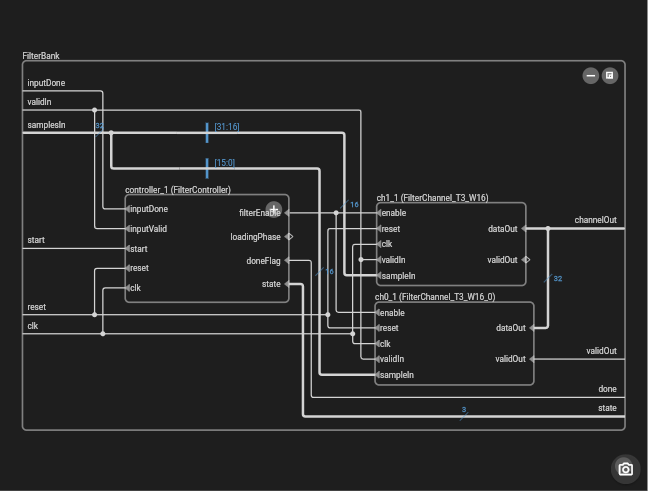

# ROHD Schematic Viewer

ROHD Schematic Viewer is an interactive viewer for netlists produced by the
**ROHD netlister** using  a superset of the **Yosys JSON** netlist format (which
are also supported). It is designed for exploring ROHD-generated designs in
Visual Studio Code, a web browser, or a native Flutter application.

Use it to navigate a design hierarchy, inspect module ports and internal
connections, find and highlight nets, and progressively expand the logic
relevant to an investigation.

**[Open the hosted ROHD Schematic Viewer](https://intel.github.io/rohd-schematic-viewer/)**

[]([images/schematic-demo.mp4](https://github.com/user-attachments/assets/2e3e70cc-5a71-4585-baf7-370c9444a002))

*Click the image to watch the viewer progressively expand a design and reveal
the connections that matter.*

<!--
Publishing checklist for https://github.com/intel/rohd-schematic-viewer:
1. After the GitHub repository exists, upload `images/schematic-demo.mp4` and
   `images/schematic-extension.mp4` as video/mp4 GitHub user attachments
   associated with intel/rohd-schematic-viewer.
2. Replace the local video links and captions with the returned
   https://github.com/user-attachments/assets/... URL on its own line so GitHub
   renders the inline video player.
3. Verify playback from the rendered README, then delete the committed MP4s if
   the local fallbacks are no longer wanted.

   Inline advice:  place in an issue and use that link.
-->

## Generate a Netlist Directly with ROHD

ROHD Schematic Viewer requires a netlist in the
[Yosys JSON netlist format](https://yosyshq.readthedocs.io/projects/yosys/en/latest/cmd/index_backends.html#write-json-write-design-to-a-json-file).
Plain Yosys JSON is sufficient for schematic exploration. For a ROHD design,
build the top-level module and pass it to `NetlistService`; ROHD-generated
netlists can also preserve ROHD types for structured signals:

<!-- This is a future API change
```dart
final dut = MyModule(...);
await dut.build();

final netlist = NetlistService(
  dut,
  outputPath: 'build/design.rohd.json',
);
```

`NetlistService` is the supported API for generating the netlist.
-->

You can generate a netlist from any ROHD top-level module with a small Dart
program. Replace `MyModule` with the top-level module from your design, and
make sure the program is run from a Dart or Flutter package that depends on
`rohd`:

```dart
import 'dart:io';
import 'package:rohd/rohd.dart';

Future<void> main() async {
  final myModule = MyModule();
  await myModule.build();

  final synthesizer = NetlistSynthesizer();
  final builder = SynthBuilder(myModule, synthesizer);
  final netlistJson =
      synthesizer.generateCombinedJson(builder, myModule);
  print(netlistJson);

  await Directory('build').create(recursive: true);
  await File('build/my_hardware.rohd.json').writeAsString(netlistJson);
}
```

For example, save the program as `tool/generate_netlist.dart` and run:

```bash
dart run tool/generate_netlist.dart
```

Then open `build/my_hardware.rohd.json` in the viewer. For source navigation
metadata in the VS Code extension, use the `NetlistService` example below
instead.

## Choose How to Open the Viewer

### Visual Studio Code

The VS Code extension is the recommended option when schematic exploration is
part of an editing or debugging workflow.

After installing the extension:

1. Right-click a Yosys JSON file and select **Open as Schematic**.
2. Or run **Open as Schematic** from the Command Palette.
3. Or use **Open With...** and select the schematic custom editor.

The schematic opens as a custom editor in the current VS Code workspace. This
mode enables integration with compatible ROHD extensions, including ROHD Wave
Viewer.

### Web Browser

Use the hosted application without installing an extension:

**[Open ROHD Schematic Viewer](https://intel.github.io/rohd-schematic-viewer/)**

Select a Yosys JSON netlist from your computer. The hosted viewer processes the
file locally in your browser; it does not upload the netlist to an application
server. This release supports interactive schematic traversal in the browser.
The standalone hosted application processes the netlist locally in the browser.

### Desktop Application

Run the native Flutter application for a standalone desktop experience. The
application initially loads the bundled demonstration schematic; use its file
picker to open another Yosys JSON netlist. This standalone application does not
currently provide services beyond schematic exploration.

Instructions for building and running desktop, web, and VS Code extension
configurations are in [docs/BUILD.md](docs/BUILD.md).

## Quick Start

1. **Generate a Yosys JSON netlist**, using `NetlistService` for a ROHD design.
2. **Open the netlist.**
3. **Click a module instance** to inspect it in the design hierarchy.
4. **Expand a module** with its `+` control to reveal its internal logic.
5. **Click a wire** to highlight every connected segment.
6. **Search for a wire** with `Ctrl+F` or `Cmd+F` when the relevant net is not
   visible.
7. **Double-click a highlighted wire** to zoom to its connected region.

The viewer supports incremental expansion and collapse, so large designs can be
explored without rendering every level of hierarchy at once.

## Explore a Design Hierarchy

Click module instances to select them, then use their expansion controls to
reveal or hide internal structure. Click a port to incrementally show or
collapse only the logic connected through that port.

This focused expansion is useful for tracing a signal through a large design:

- expand a module to inspect its cells and connections;
- expand an individual port to follow only the relevant fanin or fanout;
- collapse modules or ports that are no longer relevant;
- use ROHD type information to inspect `LogicArray` values and
  `LogicStructure` fields with their intended structure.

## Find and Inspect Wires

Click a wire to highlight all of its connected segments in orange. Hover over a
wire to view its signal name and hierarchy path. In an embedded or DevTools
workflow that supplies current signal values, the tooltip also displays the
value.

Use **Find Wire** with `Ctrl+F` or `Cmd+F` to search by name or hierarchy path:

- search for a full path such as `FloatAdder/mantissa_sum`;
- enter a partial name such as `mantissa` to find related wires;
- use the arrow keys to navigate results and `Enter` to select one;
- allow the viewer to expand collapsed blocks automatically when a result is
  inside them.

The result counter identifies the current match and total number of matches.

## Navigate the Schematic

| Action | Control |
| --- | --- |
| Select a wire or module | Click |
| Highlight all segments of a wire | Click a wire |
| Zoom to the highlighted wire | Double-click |
| Fit the complete schematic | `F` |
| Find a wire | `Ctrl+F` / `Cmd+F` |
| Navigate wire-search results | `Up` / `Down` |
| Select the current search result | `Enter` |
| Close wire search | `Esc` |
| Pan | Scroll or click-drag |
| Zoom | `Ctrl+Scroll` / `Cmd+Scroll` |

The in-application Help button contains the current interaction reference.

<!--
## Send Signals Between ROHD Viewers in VS Code

When ROHD Wave Viewer and ROHD Schematic Viewer are open in the same VS Code
session, the selected signal's context menu includes **Send Signal** or
**Send Signals**.

1. Select one or more schematic nets.
2. Right-click the selection.
3. Choose **Send Signal** or **Send Signals**.
4. The receiving viewer locates the corresponding hierarchy paths.

This works in both directions:

- send schematic nets to Wave Viewer to add their recorded waveforms;
- send waveform signals to Schematic Viewer to locate the associated nets.

If an internal schematic net does not have its own recorded waveform, the
viewer can send a directly connected module output or parent-module input so a
useful driving waveform can still be added.

The Send item appears only while another compatible viewer is registered. Open
both custom editors, and reload the VS Code window after installing or updating
either extension.
-->

<!--
## Navigate to Source

Source navigation documentation will be published when the feature is
available.
-->

## JSON Format Support

ROHD Schematic Viewer reads the **Yosys JSON netlist format**:

```json
{
  "creator": "Yosys 0.35 (git sha1 abcdef1, clang version 15.0.0)",
  "modules": {
    "top": {
      "ports": { ... },
      "cells": { ... },
      "netnames": { ... }
    }
  }
}
```

See the
[Yosys `write_json` documentation](https://yosyshq.readthedocs.io/projects/yosys/en/latest/cmd/index_backends.html#write-json-write-design-to-a-json-file)
for the base format and
[docs/netlist_json_format.md](docs/netlist_json_format.md) for the ROHD-specific
extensions supported by the viewer.

## Troubleshooting

### A schematic does not load

- Confirm that the file is valid Yosys JSON.
- Open VS Code Developer Tools (`F12`) and check for errors when using the
  extension.
- If VS Code reports that the Flutter renderer is unavailable, rebuild the
  extension with `make build` or reinstall it with `make install`.

### A wire or connection is not visible

- Expand the containing module or port.
- Use `Ctrl+F` or `Cmd+F` to search for the wire by name or hierarchy path.
- Confirm that the input netlist includes the relevant cells, connections, and
  net names.

### Send is not in the right-click menu

**Send Signal(s)** is intentionally hidden until another compatible ROHD viewer
registers in the current VS Code session. Open the other viewer, or reload the
VS Code window after installing or updating an extension.

<!--
### Source navigation is not in the right-click menu

Source actions appear only when source mappings are available for the selected
module. Use the VS Code extension and open a netlist enhanced with
File/Line/Column source information.
-->

## Development and Contributions

This README is the user guide. Instructions for selecting dependency modes,
running Flutter configurations, packaging the VS Code extension, and
troubleshooting builds are in [docs/BUILD.md](docs/BUILD.md).

- [Developer documentation map](docs/README.md)
- [Report an issue](https://github.com/intel/rohd-schematic-viewer/issues)
- [ROHD](https://github.com/intel/rohd)
- [Yosys](https://github.com/YosysHQ/yosys)

---

Copyright (C) 2026 Intel Corporation  
SPDX-License-Identifier: BSD-3-Clause
